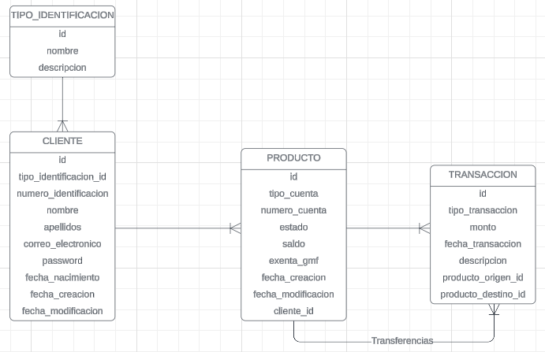

# Proyecto de Entidad Financiera

Este proyecto es la prueba técnica para F2X. La aplicación gestiona clientes, productos financieros (cuentas corrientes y de ahorro) y transacciones (consignaciones, retiros y transferencias). Está desarrollada usando la arquitectura por capas. Además está construida con Spring Boot 3 y Java 22, utilizando Maven como herramienta de gestión de dependencias. La base de datos utilizada es PostgreSQL y tanto la aplicación como la base de datos están dockerizadas. En el archivo schema.sql se encuentran los scripts para la creación de las tablas, funciones y triggers en la base de datos.

## Resumen

El objetivo de esta aplicación es proporcionar un sistema básico de gestión bancaria que permita:
- Crear, modificar y eliminar clientes.
- Crear, modificar y eliminar productos financieros.
- Realizar transacciones financieras entre productos.

## Esquema de la Base de Datos




## Tecnologías y Herramientas Utilizadas

- **Java 22**
- **Spring Boot 3**
- **Spring Data JPA**
- **Spring Web**
- **Spring Security**
- **Lombok**
- **PostgreSQL**
- **Docker**
- **Docker Compose**
- **JUnit 5**
- **Mockito**
- **Springdoc OpenAPI (Swagger)**

## Requisitos

- **Docker**: Asegúrate de tener Docker y Docker Compose instalados en tu máquina.
- **JDK 22**: Asegúrate de tener Java 22 instalado.
- **Maven**: Asegúrate de tener Maven instalado.

## Ejecución de la Aplicación

### Clonar el Repositorio

```bash
git clone https://github.com/tu_usuario/entidad-financiera.git
cd entidad-financiera
```
### Construir y Ejecutar la Aplicación con Docker
Esto construirá y ejecutará tanto la aplicación de Spring Boot como la base de datos PostgreSQL en contenedores Docker.
```bash
docker-compose up --build
```
### Acceder a la Aplicación
La documentación de Swagger UI estará disponible en http://localhost:8080/swagger-ui.html.
